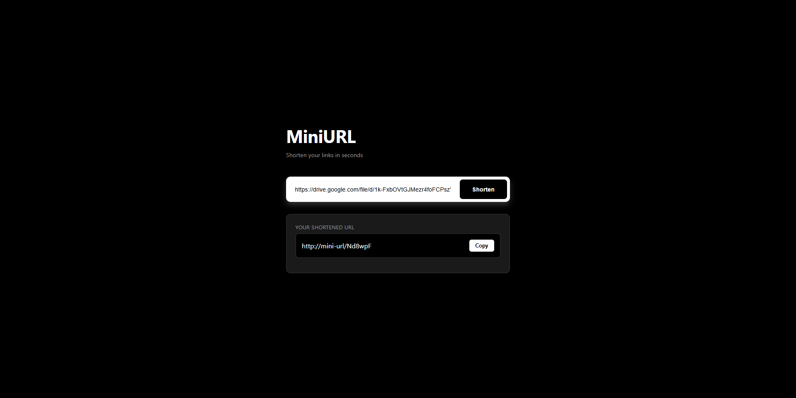

# MiniURL 🚀

[](https://www.python.org/)
[](LICENSE)

**MiniURL** is a fast and lightweight Python web application that shortens long URLs into compact, shareable links. Built with Flask and SQLite, it features automatic redirection, unique short code generation, and persistent storage. It provides a simple, reliable URL shortening solution suitable for developers and web projects.

---

## Screenshot

<p align="center">
  
</p>

---

## Features

- Shorten long URLs into unique, short codes.
- Automatic redirection from short URL to the original URL.
- Persistent storage using SQLite.
- Easy to extend for custom domains, analytics, or user accounts.

---

## Installation

1. **Clone the repository**

```bash
git clone https://github.com/wilfredo-domanico-jr/MiniURL.git
cd MiniURL
```

2. **Create and activate a virtual environment**

```bash
python -m venv venv
# Windows
.\venv\Scripts\activate
# macOS/Linux
source venv/bin/activate
```

3. **Install dependencies**

```bash
pip install -r requirements.txt
```

```bash
python app.py
```

---

## License

This project is licensed under the [MIT License](LICENSE).

---
